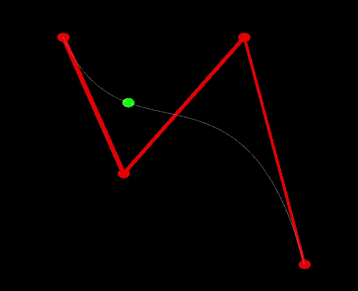

# An Underwater Journey

## Progress Summary

1. Summarize what you have accomplished so far.

	<table>
		<caption>Achieved Goals</caption>
		<tr>
			<th></th>
			<th>Ugo Novello</th>
			<th>Gabriel Jiménez</th>
			<th>Michael Glanznig</th>
		</tr>
		<tr>
			<td>Week 1</td>
			<td>Research for the project proposal</td>
			<td>Research for the project proposal.</td>
			<td></td>
		</tr>
		<tr>
			<td>Week 2</td>
			<td>Add fog features, start working on terrain generation</td>
			<td>Start working on wave simulation, then start doing research on Bezier Curves.</td>
			<td></td>
		</tr>
		<tr>
			<td>Week 3</td>
			<td>Continue working on terrain generation, start L-systems</td>
			<td>Implement WebGL functions for Bezier Curves up to degree 4.</td>
			<td></td>
		</tr>
	</table>

2. Show some preliminary results.

{width="300px"}

3. Optionally present the validation of any feature you have already implemented. This is not mandatory, but it can help you get useful feedback for the final report.

	- Fog

		- Implementation

			We applied a color during the rendering of every object, based on the distance between the viewer and the object. Distance at which the for is least intensive and most intensive, fog color and maximum and minimum fog intensity can be tweaked from the overlay. Fog can also be toggled on and off with a hotkey.
			If time permits it, color's alpha value will be partially determined by a noise texture.

		- Validation

			Provide evidence (plots, screenshots, animations, etc.) that the feature works as expected.

4. Report the number of hours each team member has dedicated to the project (as recorded on Moodle). Comment on the accuracy of your initial time estimates. Critically reflect on your work plan and assess if you are on track.

	<table>
		<caption>Worked Hours</caption>
		<tr>
			<th></th>
			<th>Ugo Novello</th>
			<th>Gabriel Jiménez</th>
			<th>Michael Glanznig</th>
		</tr>
		<tr>
			<td>Week 1</td>
			<td>3</td>
			<td>3</td>
			<td></td>
		</tr>
		<tr>
			<td>Week 2</td>
			<td>4</td>
			<td>4</td>
			<td></td>
		</tr>
		<tr>
			<td>Week 3</td>
			<td></td>
			<td></td>
			<td></td>
		</tr>
	</table>

## Schedule Update

1. Acknowledge any delays or unexpected issues, and motivate proposed changes to the schedule, if needed.

	We didn't really start the project until Week 2 because we spent Week 1 doing research and writing the proposal.

	Furthermore, there was a change of plans in terms of the features, as 'Wave Simulation' was subtituted by 'Bezier Curves' and 'Posterization', so the
	work from Week 2 was also impacted.
	It also turned out some features like terrain generation are more challenging than expected, which lead to some delay but should no be a major issue.

2. Present the work plan for the remaining time.

	<table>
		<caption>Updated Schedule</caption>
		<tr>
			<th></th>
			<th>Ugo Novello</th>
			<th>Gabriel Jiménez</th>
			<th>Michael Glanznig</th>
		</tr>
		<tr>
			<td>Week 4</td>
			<td>Finish L-Systems</td>
			<td>Posterization. Start texture generation.</td>
			<td></td>
		</tr>
		<tr>
			<td>Week 5</td>
			<td>Finish terrain generation and place l-systems generated elements on it</td>
			<td>Finish texture generation. Put everyhing together</td>
			<td></td>
		</tr>
		<tr>
			<td>Week 6</td>
			<td>put together video and practice</td>
			<td>put together video and practice</td>
			<td>put together video and practice</td>
		</tr>
	</table>
