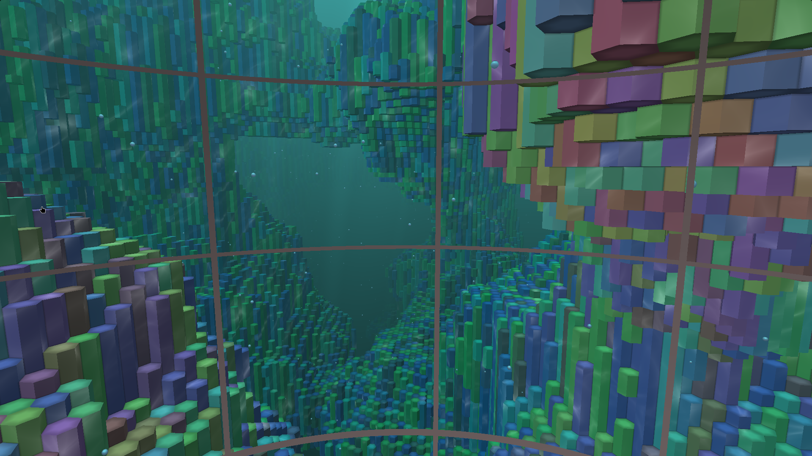
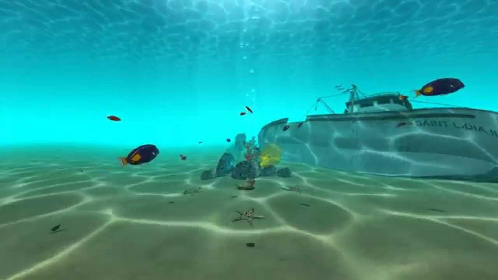
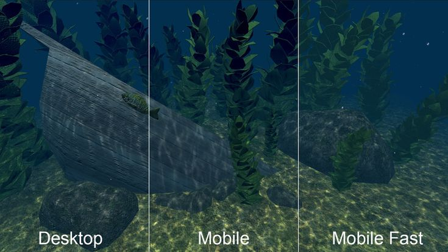

# An underwater journey

{width="300px"}
{width="300px"}
{width="300px"}

## Abstract

The goal would be to mainly represent an underwater network of caves with procedurally generated textures for the walls, rocks, and so on. There would be algae generated with an l-system on the walls, swimming fishes controlled with boids and fog for an underwater feeling. On the surface, water would move with either random waves or wind waves. If we have time, we could fairly simply adapt this underwater world to create a surface with birds, trees and biomes.
This would create a whole underwater scene in which we could evolve and (if used in an other project or by someone else) put the basis for a game or even a virtual reality experience.
The biggest challenge is probably going to put all the methods together in a coherent and working program. Making sure fishes don't swim into walls, placing algae correctly, generating waves on the procedurally generated water, and so on. An other challenge is to allow the user to evolve naturally in the world while also providing him tools to play with some settings we give him (number of fishes, speed, size, fog density, algae parameters, ideally allowing to create waves manually, tweaking textures, and so on).

## Features

| Feature               | Points       | Adapted Points |
|-----------------------|--------------|----------------|
| Fog                   | 5            | 5              |
| Texture generation    | 10           | 10             |
| Terrain generation 3d | 10           | 10             |
| l-systems             | 10           | 10             |
| wave simulation       | 20           | 15             |
| Boids                 | 20           | 20             |

## Schedule

<table>
	<tr>
		<th></th>
		<th>Novello Ugo</th>
		<th>Gabriel Jiménez</th>
		<th>Michael Glanznig</th>
	</tr>
	<tr>
		<td>Week 1</td>
		<td>fog + start terrain generation</td>
		<td>wave simulation</td>
		<td>boids</td>
	</tr>
	<tr>
		<td>Week 2</td>
		<td>terrain generation + l-systems</td>
		<td>wave simulation</td>
		<td>boids</td>
	</tr>
	<tr>
		<td>Week 3</td>
		<td>overlay for settings</td>
		<td>texture generation</td>
		<td>start merging</td>
	</tr>
	<tr>
		<td>Week 4</td>
		<td>putting everything together</td>
		<td>putting everything together</td>
		<td>putting everything together</td>
	</tr>
	<tr>
		<td>Week 5</td>
		<td>improve settings and controls</td>
		<td>interaction with water</td>
		<td>boid collision with terrain</td>
	</tr>
	<tr>
		<td>Week 6</td>
		<td>above water implementation (textures/biomes)</td>
		<td>above water implementation (birds)</td>
		<td>above water implementation (trees)</td>
	</tr>
</table>

## Resources

fog: 

- https://lettier.github.io/3d-game-shaders-for-beginners/fog.html

Texture generation:

- https://thebookofshaders.com/12/
- https://www.shadertoy.com/view/llS3RK
- https://www.diva-portal.org/smash/get/diva2:618262/FULLTEXT02.pdf
- http://www.upvector.com/?section=Tutorials&subsection=Intro%20to%20Procedural%20Textures

3D terrain generation:

- https://github.com/josephg/noisejs
- https://www.alanzucconi.com/2022/06/05/minecraft-world-generation/ (idea for minecraft-like biomes)
- https://gist.github.com/patriciogonzalezvivo/670c22f3966e662d2f83 (3d noise functions)
- https://www.shadertoy.com/view/XsX3zB (3d simplex noise)

l-systems:

- https://www.michael-hansmeyer.com/l-systems
- https://en.wikipedia.org/wiki/L-system
- https://github.com/FrancescoGradi/L-System-Trees
- https://gpfault.net/posts/generating-trees.txt.html

wave simulation:

- https://github.com/MikaelKalajdzic/watersim

particles:

- https://www.opengl-tutorial.org/intermediate-tutorials/billboards-particles/particles-instancing/
- https://learnopengl.com/In-Practice/2D-Game/Particles
- https://vercidium.com/blog/opengl-particle-systems/

boids:

- https://observablehq.com/@rreusser/gpgpu-boids
- cs-214 lab:boids https://cs-214.epfl.ch/labs/boids/

idea:

- https://www.shadertoy.com/view/MdlfRl
